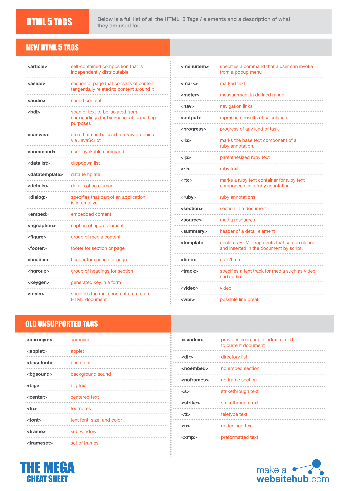
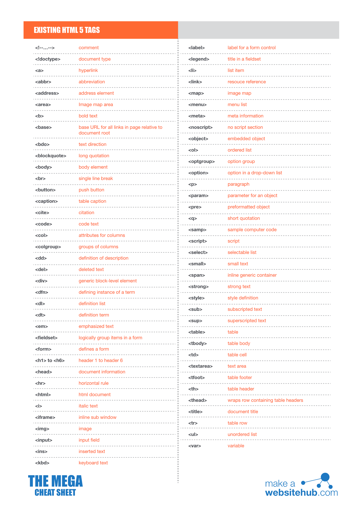
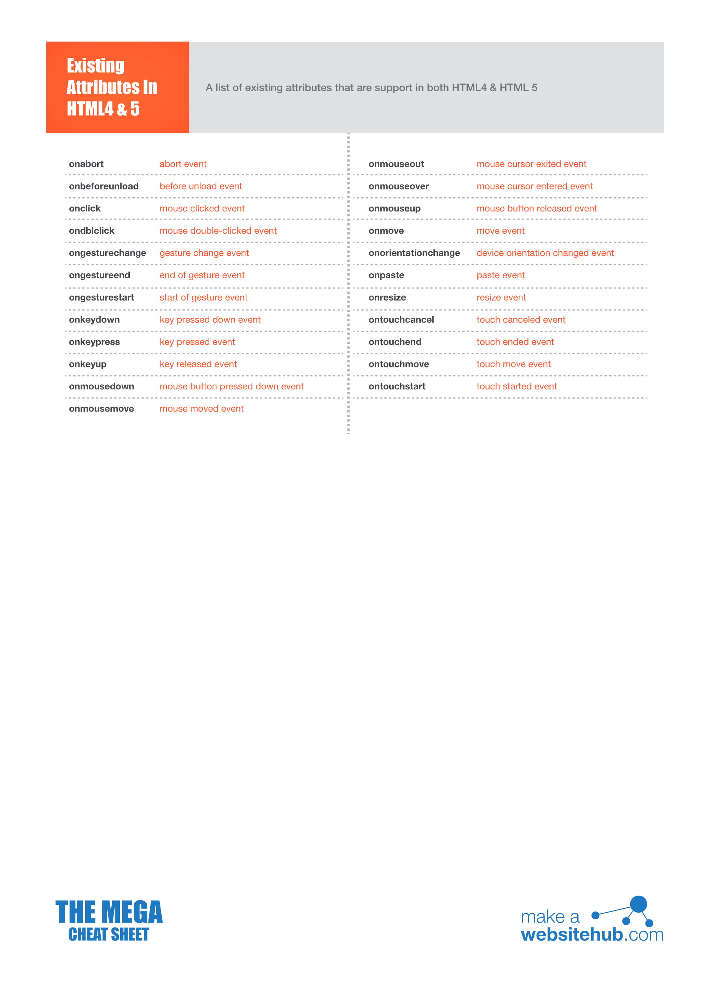
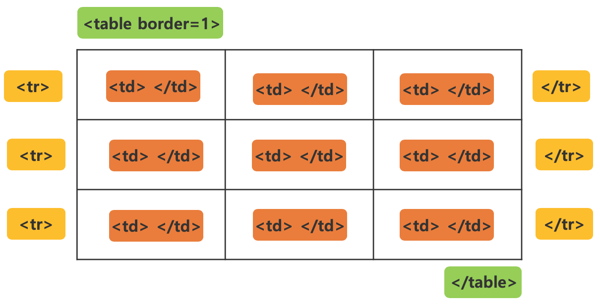

# HTML 란?

- HTML(Hyper Text Markup Language) 는 웹 환경(Hyper)에서 그 내용을 볼 수 있도록 한 마크업 언어로서 각 요소를 태그(tag) 라고 하는데, 마크업은 이 태그를 여는 부분과 닫는 부분의 사이에 표시할 내용을 마크업한다고 말합니다.
- 여기서 웹 페이지(web page)는 월드 와이드 웹 상에 있는 개개의 HTML로 작성된 문서를 가리킵니다. 
- .gif, jpg, .ai, .pdf, .doc, .hwp 이와 같은 확장자 포맷(형식)이 있듯이 HTML 은 .htm, .html 확장자 포맷을 가지고 있습니다. 
- html 문서는 단순히 텍스트 파일에 불과하고 웹 브라우저가 해석을 해서 구조를 통해 화면에 렌더링 해주게 되고 사용자는 View 라고 하는 스크린(브라우저 화면)을 통해 접하게 되는 것입니다.
- 현재는 웹 문서의 표준을 HTML5 로 규정하고 있습니다.

<br>







<br>

## 1. HTML의 기본 문서 구조

- HTML은 머리(head)와 몸(body)로 이루어져있다고 생각하면 편합니다.
- head는 HTML의 전반적인 특성을 설정하는 곳 입니다.
- body는 화면에 출력될 내용들을 마크업하는 곳 입니다.
- 모든 태그는 <여는태그> </닫는태그> 가 같습니다. 다만, 일부 태그인 link, meta, input, img 태그 등은 여는태그 부분만 존재하는 몇 가지 예외되는 태그가 있습니다.
- 태그에는 기본(필수) 속성과 추가 속성 등을 지정하게 됩니다.
- 모든 태그는 정식 명칭은 요소(Element)라고 합니다.

```comment
<!DOCTYPE html>
<html>
    <head>
        <!-- 태그 내에서의 각주 -->
        <title></title>
        <meta />
        <link rel="" href="" />
        <style>
        /* 스타일 태그 내부의 각주 */
        </style>
        <script>
        //스크립트 태그 내부의 한 줄 각주
        /*
        스크립트 태그 내부의
        여러 줄 각주
        */
        </script>
    </head>
    <body>
        <a href=""></a><!-- a 태그의 기본 속성은 href입니다. -->
        <!-- img 태그의 기본 속성은 src와 alt 속성입니다. -->
        <!-- input 요소의 기본 속성은 type 속성이며, name, id, class는 추가 속성입니다. -->
        <input type="text" name="" id="" class="">
    </body>
</html>
```

```html
<!DOCTYPE html>
<html lang="en">
<head>
    <meta charset="UTF-8">
    <meta name="viewport" content="width=device-width, initial-scale=1.0">
    <title>기본 웹 문서</title>
    <!-- 이 곳의 문서의 특성이나 설정, 화면 출력전에 해야 할 일들을 마크업합니다. -->
    <!-- 이 곳에는 link, title, meta, style, script 태그 등을 필요에 따라 마크업할 수 있습니다. -->
</head>
<body>
    <!-- 이 곳의 화면에 출력될 내용들을 마크업합니다. -->
</body>
</html>
```

<br><hr><br>

## 2. HEAD 내부 요소

| 용도명 | 태그명 | 설명 | 사용예 |
|---------------|--------| ----------------------------------------------------|-------------------------------------------------------------|
| 페이지 제목 | title | 현재 웹페이지의 탭에 나타나는 제목을 설정합니다. | &lt;title&gt;가산동에 오신 것을 환영합니다.&lt;/title&gt; |
| 뷰포트 설정 | meta | 현재 웹페이지의 화면출력에 대한 설정을 합니다. | &lt;meta name="viewport" content="width=device-width, initial-scale=1.0"&gt; |
| SEO 페이지 제목 | meta | 현재 웹페이지가 검색엔진에 노출되었을 때의 제목부를 나타냅니다. | &lt;meta name="subject" content="가산동 소개(Gasandong Intro)" /&gt; |
| SEO 페이지 설명 | meta | 현재 웹페이지가 검색엔진에 노출되었을 때의 설명부를 나타냅니다. | &lt;meta name="description" content="가산동, 패션, 아웃렛, IT빌딩, 디지털산업단지, 가산동 맛집" /&gt; |
| SEO 페이지 검색어 | meta | 현재 웹페이지가 검색엔진에 잘 노출될 수 있는 검색 단어를 설정합니다. | &lt;meta name="keywords" content="가산동, 패션, 아웃렛, IT빌딩, 디지털산업단지, 가산동 맛집" /&gt; |
| 오픈그래프 타입 | meta | 현재 페이지의 URL을 다른 애플리케이션이나 SNS 등에 보낼 때 표시될 애플리케이션 정보에서 애플리케이션의 타입을 설정합니다. | &lt;meta property="og:type" content="website" /&gt; |
| 오픈그래프 제목 | meta | 현재 페이지의 URL을 다른 애플리케이션이나 SNS 등에 보낼 때 표시될 애플리케이션 제목부를 설정합니다. | &lt;meta property="og:title" content="gasandong" /&gt; |
| 오픈그래프 설명 | meta | 현재 페이지의 URL을 다른 애플리케이션이나 SNS 등에 보낼 때 표시될 애플리케이션 설명부를 설정합니다. | &lt;meta property="og:description" content="가산동, 패션, 아웃렛, IT빌딩, 디지털산업단지, 가산동 맛집" /&gt; |
| 오픈그래프 이미지 | meta | 현재 페이지의 URL을 다른 애플리케이션이나 SNS 등에 보낼 때 표시될 애플리케이션 썸네일을 설정합니다. | &lt;meta property="og:image" content="./images/site.png" /&gt; |
| App 아이콘 설정 | link | 웹 애플리케이션이 설치되었을 때 나타나는 아이콘을 지정합니다. | &lt;link rel="icon" href="./images/favicon.png" /&gt; |
| 바로가기 아이콘 설정 | link | 웹 애플리케이션이 실행되었을 때 나타나는 페이지 탭에 나타나는 아이콘을 지정합니다. | &lt;link rel="shortcut icon" href="./images/favicon.png" /&gt; |
| 외부 스타일 가져오기 | link | 외부 스타일인 .css 파일을 가져올 때 지정합니다. | &lt;link rel="stylesheet" href="./css/bootstrap.min.css" /&gt; |
| CDN 방식으로 스타일 불러오기 | link | 외부 사이트에서 해당 스타일 파일을 다운로드 받지 않고, 직접 URI를 연결하여 외부 스타일을 로딩합니다. | &lt;link rel="stylesheet" href="https://use.fontawesome.com/releases/v5.7.0/css/all.css" /&gt; |
| 내부 스타일 지정 | style | 현재 문서에 있는 태그나 요소에 대한 CSS 스타일을 지정합니다. | &lt;style&gt; * { margin:0; padding; } &lt;/style&gt;
| 내부 스크립트 | script | 본문인 body 요소의 내용을 로딩하기 전에 처리해야 하는 부분을 기술합니다. | &lt;script&gt; alert("해당 내용 로딩") &lt;/script&gt; |
| 외부 스크립트 | script | 본문의 body 요소의 내용을 로딩하기 전에 외부 스크립트 파일을 로딩하여 처리합니다. | &lt;script src="./js/bootstrap.min.js" &gt;&lt;/script&gt; |


<br><hr><br>

## 3. 제목 및 문단/글자 요소

- 제목은 h1~h6 범위 안에서 아래의 예시와 같이 입력합니다.
- h1 요소의 글자 크기가 가장 크며, h6 요소의 글자 크기가 가장 작습니다.
- p 요소는 문단을 나타내는 요소입니다.
- span, strong, em, ins 등은 
- span 요소는 한 단어나 한 글자 이상의 내용을 분리할 경우 활용됩니다.
- strong 요소는 한 단어나 한 글자 이상의 내용을 굵게 표시하여 강조할 경우 활용됩니다.
- em 요소는 한 단어나 한 글자 이상의 내용을 기울임꼴로 표시하여 강조할 경우 활용됩니다.
- ins 요소는 한 단어나 한 글자 이상의 내용을 밑줄을 표시하여 강조할 경우 활용됩니다.
- h1~h6 요소와 p 요소는 블록 요소이므로 크기(폭/높이)와 모든 바깥여백과 안여백을 적용할 수 있습니다.
- span, strong, em, ins 등은 인라인 요소이므로 크기(폭/높이) 지정이 되지 않으며, 위/아래 바깥여백과 위/아래 안여백을 적용할 수 없습니다.
- br 요소는 한 문단 내에서 줄바꿈할 경우 사용하되, 가급적 자동 줄바꿈 구간에서는 사용하지 않는 것이 좋습니다.
- ``` &nbsp; ``` 와 같은 문자는 띄워쓰기 문자이며, 웹 문서에서는 여러 칸을 띄워도 한 칸 밖에 띄워지지 않으로므로 여러 칸을 띄울 경우 ``` &nbsp; ``` 를 띄울 칸 수 만큼 넣으시면 됩니다.

<br>

### 3-1. 기본 문법

- h1~h6, p 요소는 서로 겹쳐 쓸 수 없으며, 본인 요소도 겹쳐 쓸 수 없습니다.
- h1~h2 요소는 대제목인 페이지 제목이나 큰 영역의 제목에 사용됩니다.
- h3~h4 요소는 중제목인 항목제목 등에 사용됩니다.
- h5-h6 요소는 소제목인 설명부의 제목 등에 사용됩니다.

```comment
<h1>제목</h1>
<p>문단 내용 <span>단어</span> <strong>굵게</strong> <em>이태릭</em> <ins>밑줄</ins> </p>
```

<br>

### 3-2. 기본 예시

```html
<h1>h1입니다.</h1>
<h2>h2입니다.</h2>
<h3>h3입니다.</h3>
<h4>h4입니다.</h4>
<h5>h5입니다.</h5>
<h6>h6입니다.</h6>
<p>
    <span>우리 나라</span> <br><strong>대한&nbsp;&nbsp;&nbsp;&nbsp;&nbsp;민국</strong>
    <em>살기 좋은</em> 나라 <ins>대한민국</ins>
</p>
```

<br><hr><br>

## 4. 목록 요소

- ul(Unordered List)은 비순서형 목록으로 내부 안에 자식 요소는 반드시 li 태그가 되어야 합니다.
- ol(Ordered List)은 순서형 목록으로 내부 안에 자식 요소는 반드시 li 태그가 되어야 합니다.
- dl(Definition List)은 사전형태의 정의형 목록으로 내부 안에 자식 요소는 dt(그룹제목)과 dd(그룹항목) 이어야 합니다.
- li 요소는 부모 요소로 반드시 ul 또는 ol이어야 합니다.
- ul, ol, dl 요소는 서로 중첩 사용이 가능하여 다단계 중첩 메뉴인 2단 메뉴, 3단 메뉴 등을 구성할 수 있습니다.
- ul이나 ol 요소는 중첩할 경우 1단계와 2단계의 목록기호나 타입이 서로 달라집니다.
- ul, ol, dl, li, dt, dd 요소는 블록요소로서 크기(폭/높이) 지정과 모든 바깥여백과 안여백을 지정할 수 있습니다.

<br>

### 4-1. UL 또는 OL 의 목록 기호의 Type

- ul 요소나 ol 요소는 li 요소 앞에 표시할 타입을 type 속성을 활용하여 지정할 수 있습니다.
- ol 요소는 start 속성을 이용해 시작값을 지정할 수 있습니다.
- ol 요소 내에서 중간에 숫자를 건너뛸 경우 li 요소에 value 값을 지정하여 중간에 숫자를 건너뛸 수 있습니다.

| type | 설명 |
|------|----------------------------------------------------------|
| circle | 안이 채워진 원이 목록기호로 설정됩니다. |
| disc | 안이 채워진 원이 목록기호로 설정됩니다. |
| square | 안이 채워진 정사각형 목록기호로 설정됩니다. |
| 1 | 아라비아 숫자로 1, 2, 3... 의 순으로 목록숫자로 설정됩니다. |
| a | 영문 소문자로 a, b, c... 의 순으로 목록숫자로 설정됩니다. |
| A | 영문 대문자로 A, B, C... 의 순으로 목록숫자로 설정됩니다. |
| i | 로마자 소문자로 i, ii, iii... 의 순으로 목록숫자로 설정됩니다. |
| I | 로마자 대문자로 I, II, III... 의 순으로 목록숫자로 설정됩니다. |

<br>

### 4-2. 목록 요소 기본 문법

```comment
<ul>
    <li>비순서목록1</li>
    <li>비순서목록2</li>
    ....
</ul>
<ol>
    <li>순서목록1</li>
    <li>순서목록2</li>
    ....
</ol>
<dl>
    <dt>그룹제목</dt>
    <dd>항목1</dd>
    <dd>항목2</dd>
    ....
</dl>            
```

<br>

```html
<!DOCTYPE html>
<html lang="en">
<head>
    <meta charset="UTF-8">
    <meta name="viewport" content="width=device-width, initial-scale=1.0">
    <title>목록 연습</title>
</head>
<body>
    <h2>목록 태그</h2>
    <hr>
    <h3>순서있는 목록 : ol</h3>
    <p>반드시 자식 요소가 li가 되어야 한다.</p>
    <ol>
        <li>목록1</li>
        <li>목록2</li>
        <li>목록3</li>
        <li>목록4</li>
        <li>목록5</li>
    </ol>
    <ol type="I">
        <li>로마자</li>
        <li>대문자</li>
        <li>목차</li>
        <li>대한민국</li>
        <li>우리나라</li>
    </ol>
    <hr>
    <h3>순서 없는 목록 : ul</h3>
    <p>반드시 자식 요소는 li 요소이어야 한다.</p>
    <ul>
        <li>한식 뷔페
            <ul>
                <li>제육볶음
                    <ul>
                        <li>당근 제육볶음</li>
                        <li>감자 제육볶음</li>
                    </ul>
                </li>
                <li>김밥</li>
            </ul>
        </li>
        <li>떡볶이
            <ul>
                <li>밀 떡볶이</li>
                <li>쌀 떡볶이</li>
                <li>치즈 떡볶이</li>
            </ul>
        </li>
        <li>불고기
            <ul>
                <li>간장 파 불고기</li>
                <li>고추장 불고기</li>
            </ul>
        </li>
        <li>돈까스
            <ul>
                <li>등심 돈까스</li>
                <li>치즈 돈까스</li>
            </ul>
        </li>
    </ul>
    <ul type="square">
        <li>김기태</li>
        <li>강감찬</li>
        <li>이순신</li>
    </ul>    
    <hr>
    <h3>정의형 목록 : dl</h3>
    <p>자식 요소로 카테고리 그룹명에는 dt 요소를, 그룹 요소들은 dd 요소를 사용해야 한다.</p>
    <dl>
        <dt>Company</dt>
        <dd>회사소개</dd>
        <dd>연혁</dd>
        <dd>오시는 길</dd>
    </dl>
</body>
</html>
```

<br><hr><br>

## 5. 하이퍼링크 요소

- 하이퍼링크(Hyperlink) 라는 것은 단어나 기호, 그림 등을 문서 내의 다른 요소나 다른 문서로 연결해 놓은 일. 이 부분을 마우스로 클릭하면 지정된 위치로 이동하는 것을 말합니다.

<br>

### 5-1. 기본 문법

```html
<a href="내부문서URL">내부문서</a>
<a href="외부사이트URL" target="_blank">외부사이트</a>
<a href="#이동할아이디">네임앵커</a>
<a href="mailto:이메일주소">이메일보내기</a>
<a href="tel:전화번호">전화걸기</a>
<a href="sms:전화번호">문자보내기</a>
<a href="파일URL" download>다운로드</a>
<a href="javascript:함수명()">자바스크립트 실행1</a>
<a href="#" onclick="함수명()">자바스크립트 실행2</a>
```

<br>

### 5-2. 기본 예시

```html
<!DOCTYPE html>
<html lang="en">
<head>
    <meta charset="UTF-8">
    <meta name="viewport" content="width=device-width, initial-scale=1.0">
    <title>하이퍼링크 연습</title>
</head>
<body>
    <h2>하이퍼링크 요소</h2>
    <p>하이퍼링크 요소란? 해당 텍스트나 요소를 클릭하면, 다른 화면이나 페이지, 
        서비스로 이동하는 것을 말한다.</p>
    <p>a(anchor) : 앵커 -> 하이퍼링크 요소</p>
    <hr>
    <ul>
        <li><a href="ex02.html">같은 사이트 내에서 다른 페이지로 이동</a></li>
        <li><a href="https://www.naver.com" target="_blank" title="외부사이트로 이동">
            다른 사이트를 이동할 경우</a></li>
        <li><a href="#footer" title="푸터로 이동합니다.">네임앵커</a></li>
        <li><a href="mailto:kkt09072@naver.com">메일 보내기</a></li>
        <li><a href="tel:010-1234-5678">전화걸기</a></li>
        <li><a href="sms:010-1234-5678">문자 보내기</a></li>
        <li><a href="document_rule.hwp" download>다운로드</a></li>
    </ul>
    <hr>
    <div class="blank" style="height:5000px;background-color:yellow"></div>
    <div id="footer" style="background:deeppink">
        <h2>푸터</h2>
        <a href="#">위로</a>
    </div>    
</body>
</html>
```

<br><hr><br>

## 6. 미디어 관련 요소

- 미디어 관련 요소에는 img, video, audio, source, embed, object, iframe 요소가 있습니다.

<br>

### 6-1. 이미지

- img 요소는 이미지를 표시할 경우 활용되며, 기본(필수) 속성으로 이미지의 경로를 나타내는 src 속성과 이미지가 나타나지 못할 경우 대체 텍스트를 설정하는 alt 속성을 지정합니다.
- img 요소로 표현할 수 있는 이미지의 종류는 .jpg, .webp, .png, .gif 등이 있습니다.


<br>

#### 6-1-1. 이미지 요소 문법

```comment

```

<br>

#### 6-1-2. 이미지 요소 사용 예시

```html

```

#### 6-1-3. 웹 페이지에서 표현가능한 이미지 타입

- 웹 페이지에서 img 요소로 추가가 가능한 요소는 다음과 같습니다.

| MIME 타입 | 본딧말(확장자) |
|----------------------|----------------------------------------|
| image/apng | Animated Portable Network Graphics (APNG) |
| image/avif | AV1 이미지 파일 포맷 (AVIF) |
| image/gif | Graphics Interchange 포맷 (GIF) |
| image/jpeg | Joint Photographic Expert Group 이미지 (JPEG)
| image/png | Portable Network Graphics (PNG) |
| image/svg+xml | Scalable Vector Graphics (SVG) |
| image/webp | Web Picture 포맷 (WEBP) |


<br><br>

### 6-2. 오디오 요소

- audio 요소는 사운드 요소를 삽입할 경우 활용되며, 기본 속성으로 src 속성이 있지만, 웹 브라우저 마다 재생하는 코덱의 차이로 인해 제각각 지원하는 파일 형식이 다르므로, 보통 여러 타입(mp3, ogg, wav 등)의 사운드를 준비하여 source 요소의 src 속성에 지정하는 것이 일반적이며, 이는 크로스 브라우징을 위해 필요합니다.

<br>

### 6-2-1. 오디오 요소의 속성과 MIME 타입

- 오디오 요소에 지정하는 속성은 다음과 같습니다.

| 속성 | 설명 | 
|----------------|----------------------------------------------------------------|
| autoplay | 해당 페이지가 로딩되면 자동으로 오디오가 시작되도록 설정하는 속성 |
| controls | 볼륨, 탐색, 일시정지/재생 등 브라우저가 사용자 컨트롤을 제공하는 속성 |
| crossorigin | CORS를 사용해 지정한 오디오 파일을 가져올지 나타내는 열거형 속성 |
| loop | 반복 재생을 지정하는 속성 |
| muted | 음소거를 지정하는 속성 |
| preload | 재생하기 전에 먼저 오디오를 불러오게 하는 속성<br> none : 오디오를 미리 불러오지 않습니다.<br> metadata: 길이 등 오디오 메타데이터만 미리 불러오도록 지정합니다.<br> auto: 사용자가 오디오를 재생할 것으로 예상하지 않더라도 전체 오디오 파일을 미리 불러옵니다. <br> 빈 문자열: auto와 같습니다. |
| src | 삽입할 오디오의 URL |

<br>

- 오디오에서 지원하는 MIME 타입은 아래와 같습니다.

| MIME 타입 | 설명 |
|----------------------|----------------------------------------|
| audio/wave, audio/wav,<br> audio/x-wav,<br> audio/x-pn-wav | WAVE 컨테이너 형식의 오디오 파일입니다. |
| audio/webm | WebM 컨테이너 형식의 오디오 파일입니다.  |
| audio/ogg | Ogg 컨테이너 형식의 오디오 파일입니다. |
| audio/mp3 | mpeg level 3의 오디오 파일입니다. |


<br>

### 6-2-2. 오디오 요소 문법

```comment
<audio [controls | autoplay | muted | autoplay | loop]>
    <source type="MIME타입" src="파일이름을포함한사운드파일경로">
    ....
</audio>
```

<br>

### 6-2-3. 오디오 요소 사용 예시

```html
<figure>
    <figcaption>아이브의 노래를 들어보세요.</figcaption>
    <audio controls loop>
        <source type="audio/mp3" sec="./sound/ive1.mp3" />
        <source type="audio/ogg" sec="./sound/ive1.ogg" />
        <source type="audio/wav" sec="./sound/ive1.wav" />
    </audio>    
</figure>
```

<br><br>

### 6-3. 비디오 요소

- video 요소는 동영상 요소를 삽입할 경우 활용되며, 기본 속성으로 src 속성이 있지만, 웹 브라우저 마다 재생하는 음성 코덱의 차이로 인해 제각각 지원하는 파일 형식이 달라 여러 타입(mp4, ogv, webm 등)의 동영상을 준비하여 source 요소의 src 속성에 지정하는 것이 일반적이며, 이는 크로스 브라우징을 위해 필요합니다.

<br>

#### 6-3-1. 비디오 요소의 속성과 타입

- 비디오 요소에 지정하는 속성은 다음과 같습니다.

| 속성 | 설명 | 
|----------------|----------------------------------------------------------------|
| autoplay | 해당 페이지가 로딩되면 자동으로 비디오가 시작되도록 설정하는 속성 |
| controls | 볼륨, 탐색, 일시정지/재생 등 브라우저가 사용자 컨트롤을 제공하는 속성 |
| crossorigin | CORS를 사용해 지정한 비디오 파일을 가져올지 나타내는 열거형 속성 |
| loop | 반복 재생을 지정하는 속성 |
| muted | 음소거를 지정하는 속성 |
| preload | 재생하기 전에 먼저 비디오를 불러오게 하는 속성<br> none : 비디오를 미리 불러오지 않습니다.<br> metadata: 길이 등 비디오 메타데이터만 미리 불러오도록 지정합니다.<br> auto: 사용자가 비디오를 재생할 것으로 예상하지 않더라도 전체 비디오 파일을 미리 불러옵니다. <br> 빈 문자열: auto와 같습니다. |
| src | 삽입할 비디오의 URL |
| poster | 대기화면에 넣을 썸네일 이미지를 지정합니다. |

<br>

- 비디오에서 지원하는 MIME 타입은 아래와 같습니다.

| MIME 타입 | 설명 |
|----------------------|----------------------------------------|
| audio/webm | WebM 컨테이너 형식의 오디오 파일입니다.(WEBM)  |
| video/ogg | Ogg 컨테이너 형식의 오디오 파일입니다.(OGV) |
| video/mp4 | mpeg level 4의 비디오 파일입니다.(MP4) |

<br>

#### 6-3-2. 비디오 요소의 기본 문법

```comment
<video [controls | autoplay | muted | autoplay | loop | poster="대기화면이미지URL"]>
    <source type="MIME타입" src="파일이름을포함한비디오파일경로">
    ....
</video>
```

<br>

#### 6-3-3. 비디오 요소의 사용 예시

```html
<figure>
    <figcaption>아이브의 뮤직 비디오를 감상 해보세요.</figcaption>
    <video controls loop>
        <source type="video/mp4" sec="./vdo/ive1.mp4" />
        <source type="video/ogg" sec="./vdo/ive1.ogv" />
        <source type="video/webm" sec="./vdo/ive1.webm" />
    </video>    
</figure>
```

<br><br>

### 6-4. 소스 요소

- source 요소는 video나 audio 등의 부속 요소로 type 속성과 src 속성을 기본(필수) 속성을 세부사항으로 지정할 때 활용합니다.

<br>

#### 6-4-1. 소스(source) 요소를 통한 크로스 브라우징

<br><br>

### 6-5. 오브젝트(object) 요소

- object 요소는 사운드/동영상 요소를 추가할 때 활용되며, 기본(필수) 속성으로는 data 속성과 type 속성을 지정하여야 하며, HTML4에서 사용하던 방식으로 현재는 HTML5 웹 표준 문법상 크로스 브라우징 기능을 지원하지 않아 잘 사용하지 않고, video나 audio 요소를 활용하는 것이 좋습니다.

<br>

#### 6-5-1. 오브젝트 요소의 기본 문법

```
<object data="파일이름을포함한사운드파일경로" type="MIME타입">
    <param name="파라미터이름" value="true | false">
    ....
</object>
```

<br>

#### 6-5-2. 오브젝트 요소의 사용 예시

```html
<object data="./music/ive1.mp3" type="audio/mp3">
    <param name="AutoStart" value="true">
    <param name="AutoRewind" value="true">
</object>
```

<br><br>

### 6-6. 내장 요소

- embed 요소는 오디오/동영상 요소를 추가할 때 활용되며, 기본(필수) 속성으로는 data 속성과 type 속성을 지정하여야 하며, HTML4에서 사용하던 방식으로 현재는 HTML5 웹 표준 문법상 크로스 브라우징 기능을 지원하지 않아 잘 사용하지 않고, video나 audio 요소를 활용하는 것이 좋습니다.

<br>

#### 6-6-1. 내장 요소의 기본 문법

```comment
<embed src="파일명을포함한내장요소경로" [width="가로크기" | height="세로크기"]>
```

<br>

#### 6-6-2. 내장 요소의 사용 예시

```html
<embed src="./audio/ive.wma" width="560" height="313">
```

<br><br>

### 6-7. iframe 요소

- iframe은 inline frame의 약자로서 웹 페이지 안에 또 다른 웹페이지나 미디어, 콘텐츠 등을 삽입할 수 있도록하는 요소입니다.

<br>

#### 6-7-1. iframe 요소의 속성

| 속성 | 설명 | 예시 |
|-----------|--------------------------------------------------|------------------------|
| src | 프레임에 표시할 파일의 경로 또는 인터넷 주소 | src="head.html" |
| srcdoc | 프레임에 표시할 HTML 코드를 지정합니다. | srcdoc="<p>IVE MUSIC</p>" |
| name | 하이퍼링크에서 호출할 target으로 지정가능하도록 프레임의 이름을 지정 | &lt;iframe src="content.html" name="_content"&gt;&lt;/iframe&gt;<br>&lt;a href="sub_content" target="_content" &gt;서브&lt;/a&gt; |
| allow | 허용할 기능 정책을 지정합니다. | allow="fullscreen" |
| allowfullscreen | 전체화면으로 볼 수 있도록 지정합니다. | allowfullscreen |
| referrerpolicy | iframe 콘텐츠를 가져올 때 보낼 리퍼러를 설정합니다. | referrerpolicy="no-referrer" |
| sandbox | iframe의 제한 사항을 설정합니다 | sandbox="allow-same-origin" |
| frameborder | 테두리 표시여부를 지정합니다. | frameborder="0" : 표시안함<br> frameborder="1" : 표시함 |
| width | 프레임의 너비를 px 단위로 숫자만 기입하여 지정합니다. | width="400" |
| height | 프레임의 높이를 px 단위로 숫자만 기입하여 지정합니다. | width="300" |
| scrolling | 스크롤바의 표시 여부를 yes/no로 지정합니다. | scrolling="no" |
| noresize | 창의 크기를 고정시킵니다. | HTML5 이상에서는 사용하지 않음. |
| align | 프레임 내부 콘텐츠의 정렬방식.<br> 지정 가능한 값 : left &#124; center &#124; right | HTML5 이상에서는 사용하지 않음. |
| border | 테두리의 두께를 지정합니다. | HTML5 이상에서는 사용하지 않음. |
| borderclolor | 테두리 색을 지정합니다. | HTML5 이상에서는 사용하지 않음. |


<br>

##### sandbox 속성의 지정가능한 값

| 속성값 | 설명 |
|---------------|-------------------------------------------------------------------------------|
| 비어놓음 	| 모든 제한 사항(restrictions)을 적용함. |
| allow-forms | 리소스(resource)가 폼 데이터를 제출할 수 있도록 허용함. |
| allow-modals | 리소스가 모달 윈도우(modal window)를 열 수 있도록 허용함. |
| allow-orientation-lock | 리소스가 화면 방향 전환을 잠글 수 있도록 허용함. |
| allow-pointer-lock | 리소스가 Pointer Lock API를 사용할 수 있도록 허용함. |
| allow-popups | window.open()이나 target=“_blank”, showModalDialog() 등의 팝업(popup)을 허용함. |
| allow-popups-to-escape-sandbox | 모든 제한 사항이 적용된 문서(sandboxed document)에서 새로운 창(window)을 열 때 제한 사항을 상속받지 않은 창을 열 수 있도록 허용함. |
| allow-presentation | 리소스가 프레젠테이션 세션(presentation section)을 시작할 수 있도록 허용함. |
| allow-same-origin | 리소스가 same-origin policy를 통과된 것처럼 취급될 수 있도록 허용함. |
| allow-scripts | 리소스가 스크립트를 실행할 수 있도록 허용하지만, 팝업창은 생성하지 못함. |
| allow-storage-access-by-user-activation | 리소스가 Storage Access API를 사용하여 상위 스토리지 기능에 접근 요청을 할 수 있도록 허용함. |
| allow-top-navigation | 리소스가 최상위 브라우징 컨텍스트(_top)를 탐색할 수 있도록 허용함. |
| allow-top-navigation-by-user-activation | 리소스가 사용자의 요청이 있을 때만 최상위 브라우징 컨텍스트(_top)를 탐색할 수 있도록 허용함. |

<br>

##### allow 속성에 지정할 수 있는 값

| 속성값 | 설명 |
|---------------|-------------------------------------------------------------------------------|
| accelerometer | 출력 가속기에 액세스할 수 있도록 합니다. |
| ambient-light-sensor | AmbientLightSensor(주변광센서) 인터페이스에 대한 액세스를 허용합니다. |
| autoplay | 비디오 및 오디오 파일을 자동 재생할 수 있습니다. |
| battery | 배터리 상태 API에 대한 액세스를 허용합니다. |
| camera | 카메라에 대한 액세스를 허용합니다. |
| encrypted-media | 현재 미디어에 보안이 적용됩니다. |
| fullscreen | 전체 화면 모드에 대한 액세스를 허용합니다. | 
| geolocation | Geolocation API에 대한 액세스를 허용합니다. |
| gyroscope | 센서 API 자이로스코프 인터페이스에 대한 액세스를 허용합니다. |
| magnetometer | 센서 API 자력계 인터페이스에 대한 액세스를 허용합니다. |
| microphone | 기기 마이크에 대한 액세스를 허용합니다. |
| midi | 웹 MIDI API에 대한 액세스를 허용합니다. |
| payment | 지불 요청 API에 대한 액세스를 허용합니다. |
| picture-in-picture | 프레임에 이미지 넣기를 허용합니다. |
| usb | WebUSB API에 대한 액세스를 허용합니다. |
| clipboard-write | 클립보드에 쓰기를 허용합니다. |
| vibrate | 진동 API에 대한 액세스를 허용합니다. |
| web-share | 웹 공유를 허용합니다. |

<br>

#### 6-7-2. iframe 요소의 기본 문법

```comment
<iframe src="표시할파일의경로또는인터넷주소" name="프레임이름" [width="숫자" | height="숫자" | srcdoc="표시할HTML코드" | allow="허용할기능정책" | referrerpolicy="리퍼러설정" | sandbox="제한사항" | frameborder="0 | 1" ]>
</iframe>
```

<br>

#### 6-7-3. iframe 요소의 사용 예시

```html
<iframe width="1280" height="720" src="https://www.youtube.com/embed/6ZUIwj3FgUY" title="IVE 아이브 &#39;I AM&#39; MV" frameborder="0" allow="accelerometer; autoplay; clipboard-write; encrypted-media; gyroscope; picture-in-picture; web-share" referrerpolicy="strict-origin-when-cross-origin" allowfullscreen></iframe>
```

<br><hr><br>

## 7. 테이블 관련 요소

- 웹 페이지에 표를 작성할 수 있도록 하는 태그로서 각 제목행과 내용행을 그룹화하고, 각 컬럼은 한 행으로 그룹화하여 표시할 수 있습니다.

### 7-1. 테이블 기본 구성



- 위 그림은 HTML4 기준의 테이블이며, 현재는 테이블의 내용을 표시하는 tbody 요소가 더 추가되어 있습니다.

| 태그명 | 설명 |
|--------------|----------------------------------------------|
| table | 테이블 전체를 정의할 때 사용하는 ROOT 태그입니다. |
| caption | 테이블의 제목을 정의할 때 사용하는 table의 부속 태그입니다. |
| thead | 테이블의 항목이름이 있는 영역을 정의하는 table의 부속 태그입니다. |
| tfoot | 테이블의 맨 아래에 있는 통계와 같은 영역을 정의하는 table의 부속 태그입니다. |
| tbody | 테이블의 실제 표시할 데이터가 있는 영역을 정의하는 table의 부속 태그입니다. |
| tr | 테이블에서 행을 구분할 사용하는 thead나 tbody의 부속 태그입니다. |
| th | 테이블의 항목(컬럼) 이름을 지정하는 tr의 부속 태그입니다. |
| td | 테이블의 실제 데이터가 표시될 컬럼의 값을 적는 tr의 부속 태그입니다. |

<br>

### 7-2. 테이블 관련 속성

| 속성명 | 설명 |
|----------------|--------------------------------------------------------------------|
| width | 테이블의 전체 너비를 지정하는 속성으로 숫자만 값으로 입력합니다. |
| height | 테이블의 전체 높이를 지정하는 속성으로 숫자만 값으로 입력합니다. |
| cellpadding | 테이블 각 셀의 안 여백을 지정하는 속성으로 숫자만 값으로 입력합니다. |
| cellspacing | 테이블 각 셀과 셀 사이의 바깥여백을 지정하는 속성으로 숫자만 값으로 입력합니다. |
| border | 테이블의 선의 두께를 지정하는 속성으로 숫자만 값으로 입력합니다. 다만, HTML5에서는 CSS에서 설정하도록 합니다. |
| align, valign, bgcolor, bordercolor | 정렬이나 배경색, 선색을 지정하는 속성. 다만, HTML5에서는 사용하지 않습니다. |
| rowspan | 행 단위로 여러 개의 셀을 합치며, 합칠 셀의 숫자를 해당 td나 th에 지정합니다. |
| colspan | 칸 단위로 여러 개의 셀을 합치며, 합칠 셀의 숫자를 해당 td나 th에 지정합니다. |

※ rowspan과 colspan 속성은 해당 셀에만 지정합니다.

<br>

### 7-3. 테이블 기본 문법

```comment
<table [cellpadding="숫자" | cellspacing="숫자"]>
    <thead>
        <tr>
            <th>컬럼명1</th><th>컬럼명2</th><th>컬럼명3</th>
        </tr>
    </thead>
    <tbody>
        <tr>
            <td>데이터11</td><td>데이터12</td><td>데이터13</td>
        </tr>
        <tr>
            <td>데이터21</td><td>데이터22</td><td>데이터23</td>
        </tr>
        ....
    </tbody>
</table>
```

<br>

### 7-4. 테이블 기본 예시 코드

```html
    <table id="tb1" cellspacing="0" cellpadding="10">
        <caption><h2>KH 교육원 능력단위 평가표</h2></caption>
        <thead>
            <tr>
                <th>연번</th><th>이름</th><th>평가1</th><th>평가2</th><th>비고</th>
            </tr>
        </thead>
        <tbody>
            <tr>
                <td>1</td><td>김아무개</td><td>90</td><td>85</td><td>준수한 편</td>
            </tr>
            <tr>
                <td>2</td><td>박아무개</td><td>85</td><td>75</td><td>노력한 편</td>
            </tr>
            <tr>
                <td>3</td><td>이아무개</td><td>95</td><td>100</td><td>최우수</td>
            </tr>
            <tr>
                <td>4</td><td>최아무개</td><td>80</td><td>80</td><td>준수한 편</td>
            </tr>
            <tr>
                <td>5</td><td>강아무개</td><td>80</td><td>85</td><td>준수한 편</td>
            </tr>
        </tbody>
        <tfoot>
            <tr><td rowspan="2">총평</td><td colspan="4">전반적으로 준수한 편</td></tr>
            <tr><td>&nbsp;&nbsp;</td><td>&nbsp;&nbsp;</td><td>&nbsp;&nbsp;</td><td>&nbsp;&nbsp;</td></tr>
        </tfoot>
    </table>
```

<br><hr><br>

## 8. 폼 관련 요소

- 웹의 입력 양식을 말하며, 다른 요소에 비해 폼 요소는 클라이언트와 서버 간의 데이터 전송을 하는 역할을 합니다.

<br>

### 8-1. 폼 요소

- 입력 양식의 ROOT 요소이며, FORM 태그라고 하는데 다른 부속요소는 폼 컨트롤이라 합니다.

<br><br>

### 8-2. 폼 요소의 관련 속성

| 속성명 | 설명 |
|----------------|--------------------------------------------------------------------|
| accept-charset | 폼 전송시에 사용되는 문자 인코딩을 지정합니다.<br> UTF-8 또는 ISO-8859-1로 지정할 수 있습니다. |
| action | 폼이 전송될 때 양식 데이터를 보낼 위치를 지정합니다. |
| autocomplete | 폼에 자동 완성 기능을 켜거나 꺼야 하는지 여부를 지정합니다. |
| enctype | 폼이 전송될 때 양식 데이터를 인코딩하는 방법을 지정합니다. |
| method | 폼 데이터를 보낼 때 사용할 HTTP 방법을 지정합니다. <br> 값으로는 post 또는 get을 지정할 수 있습니다. |
| name | 폼의 이름을 지정합니다. |
| novalidate | 폼 전송 시 양식의 유효성을 검사하지 않도록 지정합니다. |
| rel | 연결된 리소스와 현재 문서 간의 관계를 지정합니다.  |
| target | 폼 데이터를 전송한 후 받은 응답을 표시할 위치를 지정합니다.<br> 값으로는 _blank, _self, _parent, _top, 프레임이름 등을 지정할 수 있습니다.|

<br>

#### 8-2-1. enctype 속성의 설정값

| 설정값 | 설명 |
|----------------------|---------------------------------------------------------------------------|
| application/x-www-form-urlencoded | 디폴트값으로 모든 데이터를 전송 전에 인코딩합니다. |
| multipart/form-data | 폼을 통하여 파일을 업로드하는 경우 필요합니다. |
| text/plain | 인코딩 없이 데이터를 보냅니다. |

<br><br>

### 8-3. 폼 컨트롤의 종류

- 모든 폼 컨트롤은 해당 FORM 요소 안에 있어야 합니다.

| 폼 컨트롤 종류 | 해당 태그와 타입 | 설명 |
|-------------|--------------|--------------------------------------------------------|
| 텍스트 입력란 | input type="text" | 일반적인 텍스트 입력란입니다. |
| 비밀번호 입력란 | input type="password" | 비밀번호 입력란으로 입력한 글자수 만큼 ● 이 표시됩니다. |
| 숫자 입력란 | input type="number" | 직접 숫자를 입력하거나 스피너를 통하여 숫자를 증가 또는 감소시켜 입력할 수 있습니다.<br> HTML5에서 추가된 컨트롤 |
| 일반 버튼 | input type="button" | 자바스크립트를 활용하여 이벤트를 적용시켜야 하는 일반적인 버튼입니다. |
| 이미지 버튼 | input type="image" | 배경이미지를 넣어 이미지 버튼을 추가할 수 있습니다. |
| 전송 버튼 | input type="submit" | 폼의 데이터를 정해진 action에 전송하는 역할을 하는 기본 컨트롤입니다. |
| 취소 버튼 | input type="reset | 취소 버튼은 기존의 입력 폼에 대한 내용을 모두 초기화합니다. |
| 체크 박스 | input type="checkbox" | On/Off 와 같이 여러 항목을 체크 또는 체크해제할 수 있도록 하는 기본 컨트롤로 모두 체크하거나 하나도 체크하지 않아도 됩니다. |
| 라디오 버튼 | input type="radio" | 여러 항목 중에서 반드시 하나만 선택해야 하는 곳에 활용되는 기본 컨트롤입니다. |
| 파일 버튼 | input type="file" | 파일을 업로드 할 수 있도록 해당 파일의 정보를 입력할 수 있는 기본 컨트롤입니다. |
| 숨김 | input type="hidden | 화면에는 출력되지 않으면서 특정 내용을 서버로 전달하려고 할 경우 사용하는 기본 컨트롤입니다. |
| 컬러 입력란 | input type="color" | 컬러 피커를 통하여 원하는 색상 정보를 입력합니다.<br> HTML5에서 추가된 컨트롤 |
| 날짜 입력란 | input type="date" | 날짜를 직접 입력하거나 카렌다를 표시하여 입력할 수 있도록 합니다.<br> HTML5에서 추가된 컨트롤 |
| 월 입력란 | input type="month" | 월을 직접 입력하거나 카렌다를 표시하여 입력할 수 있도록 합니다.<br> HTML5에서 추가된 컨트롤 |
| 주 입력란 | input type="week" | 주를 직접 입력하거나 카렌다를 표시하여 입력할 수 있도록 합니다.<br> HTML5에서 추가된 컨트롤 |
| 시간 입력란 | input type="time" | 시간을 직접 입력하거나 시계를 표시하여 입력할 수 있도록 합니다.<br> HTML5에서 추가된 컨트롤 |
| 이메일 입력란 | input type="email" | 이메일 입력에 대한 유효성 검증을 가능하게 하는 입력란입니다.<br> HTML5에서 추가된 컨트롤 |
| 인터넷 주소 입력란 | input type="url" | 인터넷 주소 입력에 대한 유효성 검증을 가능하게 하는 입력란입니다.<br> HTML5에서 추가된 컨트롤 |
| 검색어 입력란 | input type="search" | 검색어 입력에 대한 유효성 검증을 가능하게 하는 입력란입니다.<br> HTML5에서 추가된 컨트롤 |
| 범위 입력란 | input type="range" | 최소값과 최대값을 동시에 입력할 수 있습니다. <br> HTML5에서 추가된 컨트롤 |
| 공용 버튼 | button type="" | type을 button, submit, reset 등 원하는 타입으로 설정하여 사용할 수 있는 버튼 요소입니다. | 
| 레이블 | label | 데이터를 입력하거나 선택하는 기능은 없지만, 특정 항목에 대한 이름표를 지정할 때 사용합니다. |
| 선택 목록 상자 | select | 클릭시 해당 option 요소가 보이며, 원하는 option 을 선택할 수 있는 컨트롤입니다. |
| 옵션 | option | select/datalist 요소의 부속 요소로 해당 목록에 나타나는 option에 대한 값을 지정할 때 활용됩니다. |
| 텍스트 영역 | textarea | 여러 줄로 된 문단을 입력할 때 사용되는 컨트롤입니다. |
| 폼 분할 | fieldset | 해당 폼을 여러 항목으로 나누려고 할 경우 활용됩니다. |
| 폼 분할 제목 레이블 | legend | 해당 필드셋(폼 분할) 영역에 대한 제목 레이블을 설정합니다. |
| 데이터 목록 | datalist | input 요소의 list 속성으로 지정한 곳에 데이터 목록이 표시될 수 있도록 데이터 목록을 option 요소로 열거합니다. |

<br><br>

### 8-4. 폼 컨트롤의 속성

#### 8-4-1. 입력(input) 폼 컨트롤의 속성

- input 요소나 textarea 요소 중에서 키보드로 값을 입력받는 폼 컨트롤은 아래와 같은 속성을 필요에 따라 지정하여 사용할 수 있습니다.

| 속성명 | 설명 |
|----------------|--------------------------------------------------------------------|
| name | 해당 컨트롤 요소의 이름을 지정합니다. |
| value | 해당 컨트롤 요소가 가지는 값을 지정합니다. |
| readonly | 해당 컨트롤 요소의 값이 읽기전용으로 값을 입력 또는 편집하지 못하게 합니다. |
| disabled | 해당 컨트롤 요소를 비활성화하여 해당 컨트롤 값이 전송되지 않게 합니다. |
| size | 해당 컨트롤 요소의 입력 글자수의 너비의 크기로 화면에 나타납니다. |
| maxlength | 해당 컨트롤 요소의 입력 가능한 글자수를 제한합니다. |
| min | 숫자 입력이 가능한 컨트롤 요소에서 최소값을 제한합니다. |
| max | 숫자 입력이 가능한 컨트롤 요소에서 최대값을 제한합니다. |
| step | 숫자 입력이 가능한 컨트롤 요소에서 간격 값을 제한합니다. |
| pattern | 해당 컨트롤 요소의 유효성 검사 패턴을 지정할 수 있습니다. |
| placeholder | 해당 컨트롤 요소에 어떤 데이터를 입력하는지 어떤 형식으로 입력하는지에 대한 내용을 기재할 수 있으며,<br> 값 입력시 위치홀더 값은 사라집니다. |
| required | 해당 컨트롤 요소에 반드시 값을 입력할 수 있도록 하는 필수 입력 요소로 지정합니다. |
| autofocus | 폼이 로딩될 때 자동으로 커서가 해당 컨트롤 요소에 위치하게 합니다.<br> 단,  폼에서 하나의 컨트롤에만 적용하여야 합니다. |
| autocomplete | 해당 컨트롤 요소에 자동 완성기능을 활성화 합니다. |
| multiple | 파일 컨트롤에서 여러 파일을 선택할 수 있도록 합니다. |
| list | 해당 컨트롤에 datalist 컨트롤의 목록이 나타나게 합니다.<br> 이 때 datalist의 아이디를 해당 컨트롤의 list 속성에 기재합니다. |

<br>

#### 8-4-2. pattern의 속성을 활용한 유효성 검증

| 패턴식 | 설명 |
|----------------|------------------------------------------------------------|
| .{8,} | 최소 8글자 이상 입력 |
| ^&#91;0-9#93;{3}-&#91;0-9#93;{3,4}-&#91;0-9#93;{4} | 전화번호 형식 패턴 xxx-xxx-xxxx 또는 xxx-xxxx-xxxx |
| &#91;0-9a-zA-Z&#93;(&#91;-_\.&#93;?&#91;0-9a-zA-Z&#93;)*@&#91;0-9a-zA-Z&#93;(&#91;-_\.&#93;?&#91;0-9a-zA-Z&#93;)*\.&#91;a-zA-Z&#93;{2,3} | 이메일 정규식으로 아이디는 영문대소문자숫자가 포함되며 @기호를 중간에 포함하는 식 |
| ^&#91;가-힣#93;{2,4}&#124;&#91;a-zA-Z#93;{2,10}\s&#91;a-zA-Z#93;{2,10} | 이름 정규식으로 한글, 영문은 각 각 가능하지만, 혼용은 불가 |

<br>

#### 8-4-3. 텍스트영역 폼 컨트롤의 속성

| 속성명 | 설명 |
|----------------|--------------------------------------------------------------------|
| rows | 몇 줄까지 화면에 표시할지 지정하는 속성입니다. |
| cols | 한 줄당 몇 개의 글자까지 표시할지 지정하는 속성입니다. |

<br><br>

### 8-5. 폼 관련 요소의 기본 문법

```comment
<form action="보낼위치" method="전송방식" [name="폼이름" | enctype="인코딩방식" | rel="" | target="" | novalidate]>
    <label for="컨트롤1">
    <input type="타입" name="컨트롤이름" id="컨트롤1" />
    [<input type="타입" name="컨트롤이름" />
    ......]
    <input type="submit" value="버튼텍스트">
    <input type="reset" value="버튼텍스트">
</form>
```

<br><br>

### 8-6. 폼 관련 요소의 사용 예시

```html
<!DOCTYPE html>
<html lang="en">
<head>
    <meta charset="UTF-8">
    <meta name="viewport" content="width=device-width, initial-scale=1.0">
    <title>연습 10</title>
</head>
<body>
    <h2>회원 가입</h2>
    <hr>
    <form action="" method="post">
        <p><strong style="color:red">*</strong> 는 필수 입력 요소입니다.</p>
        <fieldset>
            <legend>기본 정보</legend>
            <table>
                <tbody>
                    <tr>
                        <th><label for="id">* 아이디</label></th>
                        <td>
                            <p>영문 소문자로 시작하면서 숫자를 혼합한 6글자 이상 12글자 이내로 조합</p>
                            <input type="text" name="id" id="id" placeholder="아이디 입력" pattern="[a-z0-9]{6,}" maxlength="12" autofocus required>
                            <button type="button" style="background:deepskyblue;color:#fff;border: none;">아이디 중복 확인</button>
                            <input type="hidden" name="idck" id="idck" value="no">
                        </td>
                    </tr>
                    <tr>
                        <th><label for="pw">* 비밀번호</label></th>
                        <td>
                            <p>비밀번호는 최소 8글자 이상 12글자 이내로 입력</p>
                            <input type="password" name="pw" id="pw" pattern="{8,}" maxlength="12" placeholder="비밀번호 입력" required>
                        </td>
                    </tr>
                    <tr>
                        <th><label for="pw2">* 비밀번호 확인</label></th>
                        <td>
                            <input type="password" name="pw2" id="pw2" placeholder="비밀번호 확인 입력" required>
                        </td>
                    </tr>
                    <tr>
                        <th><label for="name">* 이름</label></th>
                        <td>
                            <input type="text" name="name" id="name" placeholder="이름 입력" required>
                        </td>
                    </tr>
                    <tr>
                        <th><label for="tel">* 전화번호</label></th>
                        <td>
                            <input type="tel" name="tel" id="tel" pattern="" placeholder="전화번호 입력" required>
                        </td>
                    </tr>
                    <tr>
                        <th><label for="email">* 이메일 주소</label></th>
                        <td>
                            <input type="email" name="email" id="email" pattern="" placeholder="이메일 주소 입력" required>
                        </td>
                    </tr>
                </tbody>
            </table>
        </fieldset>
        <fieldset>
            <legend>추가 정보</legend>
            <table>
                <tbody>
                    <tr>
                        <th><label for="birth">생년월일</label></th>
                        <td><input type="date" name="birth" id="birth"></td>
                    </tr>
                    <tr>
                        <th><label for="age">나이</label></th>
                        <td><input type="number" name="age" id="age" min="0" max="150" step="1"></td>
                    </tr>
                    <tr>
                        <th><label for="color">좋아하는 색</label></th>
                        <td><input type="color" name="color" id="color"></td>
                    </tr>
                    <tr>
                        <th><label for="gender">성별</label></th>
                        <td><input type="radio" name="gender" id="gender1" value="1" checked> 
                            <label for="gender1"> 남</label><br>
                            <input type="radio" name="gender" id="gender2" value="2"> 
                            <label for="gender2"> 여</label>
                        </td>
                    </tr>
                    <tr>
                        <th><label for="area">청약지역</label></th>
                        <td><input type="checkbox" name="area" id="area1" value="1" checked> 
                            <label for="area1"> 수도권</label><br>
                            <input type="checkbox" name="area" id="area2" value="2"> 
                            <label for="area2"> 충청</label>
                            <input type="checkbox" name="area" id="area3" value="3"> 
                            <label for="area3"> 호남</label><br>
                            <input type="checkbox" name="area" id="area4" value="4"> 
                            <label for="area4"> 영남</label>
                            <input type="checkbox" name="area" id="area5" value="5"> 
                            <label for="area5"> 기타</label>
                        </td>
                    </tr>
                    <tr>
                        <th><label for="reason">가입 목적</label></th>
                        <td>
                            <select name="reason" id="reason">
                                <option value="">선택안함</option>
                                <option value="1" selected>상품 홍보</option>
                                <option value="2">개발 학습</option>
                                <option value="3">심심풀이</option>
                            </select>
                        </td>
                    </tr>
                    <tr>
                        <td colspan="2">
                            <label for="memo">하고 싶은 말</label><br>
                            <textarea name="memo" id="memo" cols="80" rows="10"></textarea>
                        </td>
                    </tr>
                </tbody>
            </table>
        </fieldset>
        <table>
            <tbody>
                <tr>
                    <td>
                        <button type="submit">회원 가입</button>&nbsp;&nbsp;&nbsp;&nbsp;
                        <button type="reset">취소</button>  
                    </td>
                </tr>
            </tbody>
        </table>
    </form>
</body>
</html>
```

<br><hr><br>

## 9. 시멘틱 요소

- 시멘틱(Semantic) 요소는 개념적 요소로서 특정 영역을 나눌 경우 몇 개의 태그만으로 하다보면, 그룹핑 영역이 헷갈려 제대로 코딩하기가 어려으므로 기능은 없으며, 오로지 그 영역의 개념만 도입한 태그들을 의미한다.


| 태그명 | 설명 |
|------------|-------------------------------|
| header | 웹 문서의 맨 위에 위치하며, 메인메뉴와 로고타입을 포함하는 영역 |
| footer | 웹 문서의 맨 아래에 위치하며, 카피라이트와 하단 메뉴를 포함하는 영역 |
| aside | 왼쪽 또는 오늘쪽의 사이드바 영역을 의미 |
| nav | 메뉴(내비게이션) 영역을 의미 |
| article | 신문 기사과 같이 사진, 제목, 기사글 등이 들어가는 영역 |
| div | 디비전 영역을 의미하며, 뚜렷한 의미없는 항목들을 묶어 관리하는 영역 |
| section | 섹션 영역으로 보통 한 페이지에 해당하는 분량의 영역 |
| figure | 배너나 슬라이더 등의 비주얼 이미지 등이 배치되는 영역 |
| figcaption | 배너의 제목을 표시하는 영역 |

<br><br>

### 9-1. 시멘틱 요소의 예시 코드

```html
<!DOCTYPE html>
<html lang="en">
<head>
    <meta charset="UTF-8">
    <meta name="viewport" content="width=device-width, initial-scale=1.0">
    <title>해법수학</title>
    <style>#hd, #contents {  border-bottom:3px solid red; }</style>
</head>
<body>
    <!-- div#wrap>(header#hd>nav#tnb+a.logo+nav#gnb)+
        (div#contents>aside#leftside+section#data)+
        (footer#ft>address#cp) -->
    <div id="wrap">
        <header id="hd">
            <nav id="tnb">상단메뉴</nav>
            <a href="" class="logo">로고</a>
            <nav id="gnb">메인메뉴</nav>
        </header>
        <div id="contents">
            <aside id="leftside">좌측메뉴</aside>
            <section id="data"><h2>본문 영역</h2></section>
        </div>
        <footer id="ft">
            <address id="cp">Copyrights & Address</address>
        </footer>
    </div>
</body>
</html>
```
